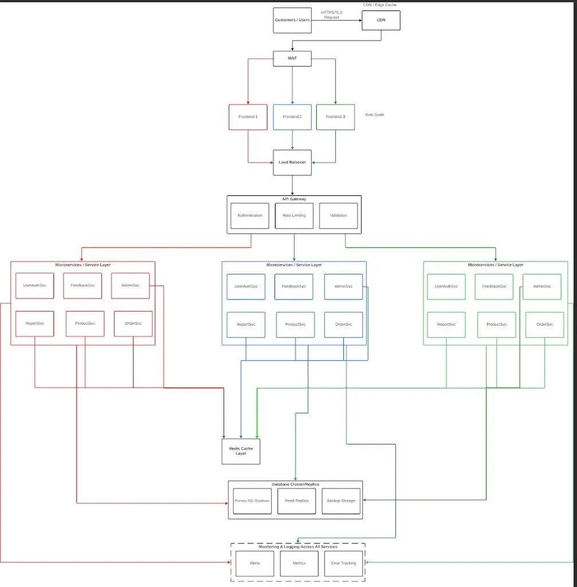

# Property Management Platform

> A scalable microservice-based Property Management Platform developed for the Platform Technologies course, demonstrating modern software architecture, collaborative development workflows, and cloud-native design principles.

---

## Project Overview

### Purpose

The Property Management Platform is designed to provide a centralized system for managing properties, user accounts, orders, reports, feedback, and administrative operations through a distributed microservice architecture.

This project serves as an academic implementation of modern platform engineering concepts, including:

* Microservice Architecture
* API Gateway Pattern
* Shared Package Development
* Infrastructure as Code
* CI/CD Practices
* Collaborative Software Development
* Scalable Frontend and Backend Design

---

## Project Objectives

The primary objectives of this project are:

* Design and implement a scalable platform architecture.
* Demonstrate service-oriented application development.
* Apply industry-standard Git workflows and code review practices.
* Develop reusable shared packages across multiple services.
* Implement testing, validation, and quality assurance processes.
* Practice collaborative development within a multidisciplinary team.

---

## System Architecture

The Property Management Platform follows a microservice-based architecture designed to support scalability, maintainability, and separation of concerns.

### Architectural Highlights

- CDN-based content delivery
- Web Application Firewall (WAF) protection
- Auto-scaled frontend cluster
- API Gateway for authentication, validation, and rate limiting
- Independent backend microservices
- Redis caching layer
- Database cluster with replication and backup storage
- Centralized monitoring and logging

### Architecture Diagram




### Architectural Principles

The system is designed around the following principles:

* Separation of Concerns
* Domain-Based Service Design
* Scalability Through Replication
* Shared Code Reusability
* API-First Development
* Fault Isolation
* Maintainability and Extensibility

---

## Repository Structure

```text
.
├── frontend/
│   └── Web application and UI components
│
├── services/
│   └── Backend microservices
│
├── packages/
│   └── Shared libraries, utilities, and configurations
│
├── infra/
│   └── Infrastructure and deployment configurations
│
├── tests/
│   └── Automated testing suites
│
├── docs/
│   └── Project documentation
│
├── CONTRIBUTING.md
└── README.md
```

---

## Technology Stack

### Frontend

* Next
* TypeScript
* Vite
* Tailwind CSS

### Backend

* Node.js
* Express.js
* TypeScript

### Database

* postgreSQL Database

### Caching

* Redis

### Infrastructure

* Docker
* Kubernetes (Planned)
* GitHub Actions

### Development Tools

* ESLint
* Prettier
* Husky
* Jest
* TypeScript

---

## Getting Started

### Prerequisites

Ensure the following software is installed:

```bash
Node.js >= 20
npm >= 10
Git >= 2.40
Docker >= 24
```

### Clone Repository

```bash
git clone <repository-url>

cd property-management-platform
```

### Install Dependencies

```bash
npm install
```

### Environment Configuration

Create a local environment file:

```bash
cp .env.example .env
```

Configure the required environment variables.

Example:


### Start Development Environment

```bash
npm run dev
```

---

## Development Workflow

All contributors are required to follow the project's Git workflow.

### Step 1: Update Local Branch

```bash
git checkout develop
git pull origin develop
```

### Step 2: Create Feature Branch

```bash
git checkout -b feature/your-feature-name
```

Examples:

```bash
feature/property-search
feature/frontend-dashboard
feature/order-management
fix/login-validation
```

### Step 3: Commit Changes

```bash
git add .
git commit -m "feat(product): add product filtering"
```

### Step 4: Push Branch

```bash
git push origin feature/your-feature-name
```

### Step 5: Open Pull Request

Create a Pull Request targeting:

```text
develop
```

### Step 6: Review and Approval

Changes must be reviewed before merging.

Direct pushes to protected branches should be avoided.

---

## Contribution Guidelines

Detailed contribution rules are available in:

```text
CONTRIBUTING.md
```

### General Rules

* Create a branch for every task.
* Never commit directly to main.
* Keep commits focused and descriptive.
* Update documentation when introducing changes.
* Follow project coding standards.
* Submit a Pull Request for review.

### Frontend Contributors

Any changes involving:

* UI Components
* Styling
* Layout Updates
* Responsive Design
* User Experience Improvements

must be developed on a dedicated branch and submitted through a Pull Request.

### Backend Contributors

Any changes involving:

* APIs
* Services
* Database Logic
* Authentication
* Business Rules

must include appropriate testing and documentation updates.

### Infrastructure Contributors

Any changes involving:

* Docker
* Deployment Configurations
* CI/CD Pipelines
* Environment Setup

must be validated before merging.

---

## Coding Standards

### Naming Conventions

| Item       | Convention          |
| ---------- | ------------------- |
| Components | PascalCase          |
| Functions  | camelCase           |
| Variables  | camelCase           |
| Constants  | UPPER_CASE          |
| Folders    | kebab-case          |
| Branches   | feature/branch-name |

### Code Quality Principles

* DRY (Don't Repeat Yourself)
* KISS (Keep It Simple, Stupid)
* SOLID Principles
* Clean Architecture
* Modular Design

### TypeScript Standards

* Avoid usage of `any`.
* Prefer explicit typing.
* Enable strict type checking.
* Reuse shared types whenever possible.

---

## Testing

Testing is required to ensure reliability and maintainability.

### Run Unit Tests

```bash
npm run test
```

### Run Coverage

```bash
npm run test:coverage
```

### Run Lint Checks

```bash
npm run lint
```

### Format Source Code

```bash
npm run format
```

---

## Continuous Integration

The project may utilize automated workflows to perform:

* Dependency Installation
* Build Validation
* Lint Checks
* Unit Testing
* Pull Request Verification

All contributors are responsible for ensuring checks pass before requesting review.

---

## Documentation

Additional documentation may be found within module-specific directories:

```text
frontend/README.md
services/README.md
packages/README.md
infra/README.md
```

Each module contains implementation-specific information relevant to that area of the platform.

---

## Academic Information

**Course:** Platform Technologies

**Project Type:** Team-Based Academic Project

**Architecture Style:** Microservices

**Development Methodology:** Git-Based Collaborative Development

---

## License

This repository is intended for educational and academic purposes only.
This is a [Next.js](https://nextjs.org) project bootstrapped with [`create-next-app`](https://nextjs.org/docs/app/api-reference/cli/create-next-app).